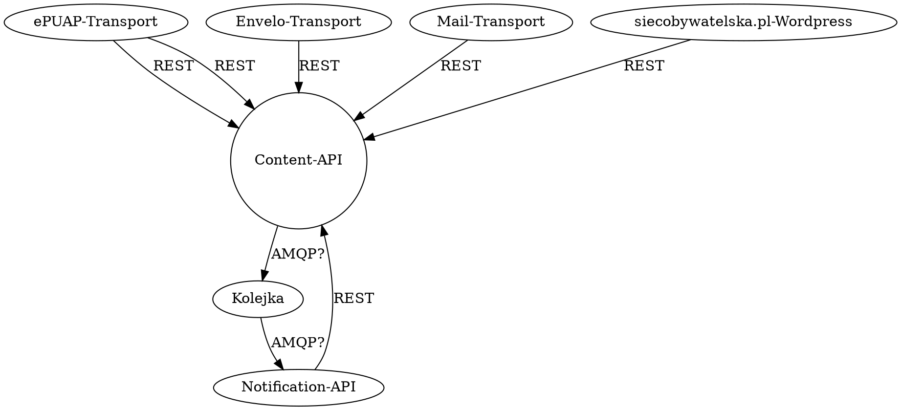

# Small_EOD

Podstawowym celem projektu jest zbudowanie systemu, który służący do usprawnienia obiegu dokumentów Stowarzyszenia, w szczególności w zakresie:

* obiegu korespondencji w zakresie spraw sądowych
* archiwizacji dokumentacji

Celem wszelkich podejmowanych przez Stowarzyszenia działań jest realizacja celów statutowych Stowarzyszenia tj. upowszechnianie i ochrona wolności i praw człowieka oraz swobód obywatelskich, a także działań wspomagających rozwój demokracji oraz wspieranie działań monitorujących i edukacyjnych, w szczególności podejmowanych przez członków i członkinie Stowarzyszenia i osoby z nimi współpracujące, na rzecz zwiększenia przejrzystości i uczciwości życia publicznego.

## Interesariusze

### Wewnętrzni

* Współpracownicy - osoby wprowadzające treści
  * pracownik - osoba, która zajmuje się przygotowaniem dokumentacji w Stowarzyszeniu, nie posiada specjalnej wiedzy na temat działania systemu
  * archiwista - osoba, która zajmuje się rejestrowaniem dokumentacji Stowarzyszenia, posiada dokłądną wiedzę na temat reguł rejestrowania dokumentacji
* Administratorzy – opiekunowie techniczny, prawo zarządzania użytkownikami

### Zewnętrzni

* Czytelnicy – naukowcy, studenci, sympatycy, którzy wymagają dostępu do odczytu do wybranych spraw

## Założenia

### Założenia zarządzania

* System rozwijany będzie małymi etapami, aby jak najszybciej dostarczał wartość dla biura Stowarzyszenia [#ZA1]
* System będzie rozwijany jako darmowe i otwarte oprogramowanie dążyć do stałej gotowości przyjęcia nowego wsparcia [#ZA2]
* W rozwoju projektu należy dążyć do ciągłość funkcjonowania procesów Stowarzyszenia [#ZA3]
* System będzie otwarty na wdrożenie w innych podmiotach, które podejmują niezależnie działania zbieżne z celami Stowarzyszenia [#ZA4]
* System będzie rozwijany w sposób umożliwiający włączenie nowych osób, także w niewielkim stopniu zaangażowania [#ZA5]

### Założenia technologi

* W doborze technologii preferowane będą rozwiązania, które umożliwiają ograniczenie kosztów utrzymania, w szczególności osobowych i licencyjnych [#ZT1] tj.:

  * wykorzystanie środowisk chmurowych
  * wykorzystanie konteneryzacji
  * aktywne utrzymywane w długoletniej perspektywie.

Uwaga: Na dzień 1 października 2019 roku [HyperOne](https://www.hyperone.com/) udostępnia Stowarzyszeniu zasoby informatyczne bez opłat. W ofercie posiada usługi tj. Wirtualne Maszyny, Bazy Danych (PostgreSQL i MySQL), Kontenery. W przygotowaniu są usługi tj. skład obiektowy (~Amazon S3, Swift), SMTP-as-a-service (~SendGrid, ~Mailgun), Kubernetes-as-a-service (Amazon EKS, Google Kubernetes Engine).

### Założenia funkcjonalności

* W początkowych etapach system będzie przeznaczony do archiwizacji dokumentów pochodzących z różnych kanałów tj.

  * poczta tradycyjna
  * poczta e-mail
  * Envelo

* W przyszłości system będzie służył także do:

  * zarządzanie przebiegiem procesu sporządzenia pism
  * powiadamiania o nowych pismach
  * kontroli terminów
  * wysyłkę pism poprzez:

    * Envelo
    * ePUAP
    * Poczta tradycyjna

* Platforma udostępnia skuteczne API
* Uwierzytelnienie z wykorzystaniem GSuite

## Architektura

W ogólnym ujęciu architekturę systemu można przedstawić jako:



Występujące elementy:

* Panel Zarządzania - bezstanowa aplikacja SPA umożliwiająca zarządzania treściami przez *Współpracowników*
* Content-API - stanowa aplikacja gromadząca i przetwarzająca dane
* Envelo-Transport - bezstanowa aplikacja odpowiedzialna za przesyłanie korespondencji do systemu Envelo
* Mail-Transport - bezstanowa aplikacja odpowiedzialna za przesyłanie i odbieranie korespondencji poprzez pocztę tradycyjną
* Notification-API - bezstanowa aplikacja odpowiedzialna za wysyłanie powiadomień o zdarzeniach lub cyklicznych raportów

W pierwszym kroku winniśmy się skupić na:

* Panel Zarządzania - aplikacja SPA umożliwiające uzyskanie treści
* Content-API - aplikacja Django umożliwiająca edycje treści

## Przypadki użycia

### rejestrowanie korespondencji przychodzącej tradycyjnej

Zwięzły opis: celem jest publikacja nowego korespondencji przychodzącej tradycyjnej

Zdarzenie inicjujące: Wybranie opcji dodania korespondencji przychodzącej przez upoważnionego użytkownika

Scenariusz (scenariusze) procesów biznesowych:

1. Pracownik wybiera dodanie nowego listu
1. System wyświetla formularz dodawania nowego listu

* Pola wynikają z interfejsu API
* **Użytkownik pomija pole "Sprawa"**

1. Użytkownik wypełnia formularz i zatwierdza **dodanie listu**
1. System weryfikuje wprowadzone dane i potwierdza ich przyjęcie.
1. Archiwista wyświetla listę listów bez przypisanych spraw.
1. Użytkownik wybiera edycje listu.
1. System wyświetla formularz edycji listu.

* Pola wynikają z interfejsu API

Sytuacje wyjątkowe:

* Podane dane nie spełniają reguł walidacji – system wyświetla komunikat błędu, proces nie jest kontynuowany do czasu poprawienia błędów i ponownego zatwierdzenia

Warunki początkowe:

* Użytkownik jest uprawniony do dodania nowego listu.

Warunki końcowe:

* Osoby przypisane do powiadomień sprawy otrzymują powiadomienie o nowym liście.
* List jest dostępny na liście listów w sprawie.
* List nie jest dostępny na liście listów nie przypisanych.

### rejestrowanie teczki sprawy

Zwięzły opis: celem jest publikacja archiwalnej teczki sprawy

Zdarzenie inicjujące: Wybranie opcji dodania nowej sprawy przez upoważnionego użytkownika

Scenariusz (scenariusze) procesów biznesowych:

1. Pracownik wybiera dodanie nowej sprawy
1. System wyświetla formularz dodawania nowej sprawy

* Pola wynikają z interfejsu API
* Interfejs umożliwia wprowadzenie także danych wielu listów

1. Użytkownik wypełnia formularz i zatwierdza **dodanie sprawy**
1. System weryfikuje wprowadzone dane i potwierdza ich przyjęcie.

Sytuacje wyjątkowe:

* Podane dane nie spełniają reguł walidacji – system wyświetla komunikat błędu, proces nie jest kontynuowany do czasu poprawienia błędów i ponownego zatwierdzenia

Warunki początkowe:

* Użytkownik jest uprawniony do dodania nowego listu.

Warunki końcowe:

* Osoby przypisane do powiadomień sprawy otrzymują powiadomienie o nowych listach.
* Sprawa jest dostępna.
* List jest dostępny na liście listów w sprawie.
* List nie jest dostępny na liście listów nie przypisanych.

### utworzenie kolekcji

Zwięzły opis: celem jest utworzenie kolekcji spraw

Zdarzenie inicjujące: Wybranie opcji dodania nowej kolekcji przez upoważnionego użytkownika

Scenariusz (scenariusze) procesów biznesowych:

1. Pracownik wybiera utworzenie nowej kolekcji
1. System wyświetla formularz dodawania nowej kolekcji

* Pola wynikają z interfejsu API

1. Użytkownik wypełnia formularz i zatwierdza **utworzenie kolekcji**
1. System weryfikuje wprowadzone dane i potwierdza ich przyjęcie.

Sytuacje wyjątkowe:

* Podane dane nie spełniają reguł walidacji – system wyświetla komunikat błędu, proces nie jest kontynuowany do czasu poprawienia błędów i ponownego zatwierdzenia

Warunki początkowe:

* Użytkownik jest uprawniony do dodania nowej kolekcji.

Warunki końcowe:

* Użytkownik posiada odnośnik umożliwiający dostęp do kolekcji oraz odczyt wszystkich listów, wydarzeń i notatek w danej sprawie.

## Obszary

* Migracja
  * dostosowanie do nowego modelu
* Zarządzanie tożsamością
  * GSuite
* Zarządzanie treścią
  * Panel zarządzania
  * Content-API
* Integracja zewnętrzna
  * GSuite
  * BIR REGON

## Content-API

### Założenia

* framework - Django & Django-REST-Framework
* kontrola uprawnień - Django
* baza danych - PostgreSQL / MySQL
* CI - GitHub Actions
* składowanie plików - Amazon S3

Django ustanowi podstawowy kształt systemu.
Django-REST-Framework pozwoli w łatwy sposób udostępnić zgromadzone dane.
GitHub Actions stanowi aktualnie podstawowy system CI w Stowarzyszeniu. Winniśmy dążyć do pokrycia co najmniej jednym testem end-to-end każdego endpointu API.
Dane będziemy przechowywać w usłudze zgodnej z Amazon S3, co pozwoli przechowywanie w przyszłości potencjalnie znacznej ilości danych niskim nakładem administracyjnym.

### Model danych

Model danych jest dostępny w dokumentacji API.

Wyróżniamy następujące elementy:

* Dictionary - dane na temat słowników danych statystycznych
* Case - dane na temat sprawy
* Institution - informacje o instytucjach
* Tag - dodatkowa konfiguracja prezentacji znaczników
* Collection - kolekcje umożliwiające dokonanie wyboru prezentowanych spraw poprzez wskazanie kryterium ich wyszukiwania
* Letter - dane na temat listów przypisanych do sprawy / nowych
* File - dane na temat plików powiązanych z listem
* Channel - słownik zawierający konfiguracje kanałów komunikacji
* Note - notatka wprowadzona przez użytkownika
* Event - dane na temat wydarzenia terminarza
* User - dane na temat użytkowników systemu
* Description - słownik opisów listów
* AdministrativeUnit - jednostki podziału terytorialnego

Szczegółowy model danych został udokumentowany w ```./swagger.yaml```. Wizualizacja możliwa poprzez [Swagger Editor](https://editor.swagger.io/?url=https://raw.githubusercontent.com/watchdogpolska/small_eod/dev/docs/swagger.yaml) lub [ReDoc](https://redocly.github.io/redoc/?url=https://raw.githubusercontent.com/watchdogpolska/small_eod/dev/docs/swagger.yaml).

#### Kolekcja

Kolekcja służy do luźnego zgrupowania spraw, które będą w szczególny sposób udostępniane na zewnątrz systemu wyłącznie do odczytu. Zgrupowanie może być dynamiczne np. "wszystkie sprawy własne Stowarzyszenia" (dla wglądu przez członków Stowarzyszenia, którzy nie mają dostępu do wszystkich spraw klientów Stowarzyszenia) lub "wszystkie sprawy z Polską Fundacją Narodową" (dla dziennikarza, który poprosił o taki dostęp, gdyż monitoruje temat) lub "wszystkie sprawy oznaczone danym znaczkiem (tagiem)".

Celem jest stworzenie luźnej warstwy prezentacji (nie zarządzania!) danych sprawy dla osób zewnętrznych, które nie mają uprawnień do edycji spraw, ani konta w systemie.

Dostęp do spraw z kolekcji może (nie musi!) wymagać uwierzytelniania danymi dostępowymi stworzonymi specjalnie dla danego odnośnika np. kodem JWT, token linku.

Zakres spraw w kolekcji może ulegać zmianie w czasie w sposób automatyczny, gdyż kolekcja będzie zawierała kryterium wyszukiwania spraw. Można także pokusić się o stworzenie w warstwie prezentacji mechanizmu do statycznych kolekcji, gdzie – podczas zapisu – zapytanie będzie konwertowane do zapytania zawierającego wykaz identyfikatory spraw. Przykładowo "tag=NSA" => "id=1 OR id=2 OR id=3 OR id=4 OR id=5". Format języka zapytań wymaga zdefiniowania (zob. [zagadnienie #103](https://github.com/watchdogpolska/small_eod/issues/103)).

Kolekcje będą stanowiły także podstawę do integracji z oprogramowaniem zewnętrznych np. Wordpress. Przykładowo redaktor strony Stowarzyszenia opracowuje artykuł, który chce uwiarygodnić poprzez dostęp do materiałów źródłowych opisanych spraw. Obecnie musi ręcznie przekopiować pliki do Wordpress. Jednak można to usprawnić poprzez pozwolenie na stworzenie kolekcji, która będzie zawierała sprawy wymienione w artykule, a następnie umieszczenie w treści artykułu znacznika "[shortcode](https://en.support.wordpress.com/shortcodes/)" lub poprzez [oEmbed](https://oembed.com/) lub dodatkowe pole w Wordpress umożliwi czytelnikom dostęp do wybranych spraw z kolekcji. Taki mechanizm integracji oznacza, że nie ma ryzyka ujawnienia poufnych danych w przypadku skompromitowania Wordpressa, gdyż Wordpress nie posiada szczególnej praw dostępu do systemu, zatem możemy na wykorzystanie takiej integracji każdemu, w przeciwieństwie do integracji, które będą modyfikowały dane w systemie i posiadały w nim szczególne prawa.

W back-endzie powyższe przekłada się na:

* ścieżka ```/collection/{collectionId}/*``` zawiera ```*/case/*/note```, ```*/case/*/letter``` i ```*/case/*/*event```
* ścieżki ```/collection/{collectionId}/case/*``` są wyłącznie do odczytu (metoda GET), aby umożliwić wyłącznie odczyt danych
* ścieżki ```/collection/{collectionId}/case/*``` posiadają zdefiniowane inne formy uwierzytelniania (parametr ```security``` zawierający ```bearerAuth```)

W front-endzie przekłada się to na sekcje prezentacji kolekcji, która może zawierać uproszczony interfejs do odczytu. Podobne mechanizmy w interfejsie użytkownika:

* udostępnienie katalogu w Google Drive - widok odczytu folderu dla użytkownika, który posiada link jest inny niż użytkownika, który jest uwierzytelniony i zarządza dokumentami

### Model uprawnień

System wyróżnia następujące uprawnienia:

* Dictionary.change
* Dictionary.view
* Dictionary.delete
* Dictionary.create
* Case.change
* Case.view
* Case.delete
* Case.create
* Institution.change
* Institution.view
* Institution.delete
* Institution.create
* Tag.change
* Tag.view
* Tag.delete
* Tag.create
* Collection.change_own
* Collection.change_all
* Collection.view
* Collection.delete
* Collection.create
* Letter.change_own
* Letter.change_all
* Letter.view
* Letter.delete
* Letter.create
* Channel.change
* Channel.view
* Channel.delete
* Channel.create
* Note.change_own
* Note.change_all
* Note.view
* Note.delete
* Note.create
* Event.change_own
* Event.change_all
* Event.view
* Event.delete
* Event.create
* User.change_own
* User.change_all
* User.view
* User.delete
* User.create
* Description.change
* Description.view
* Description.delete
* Description.create
* AdministrativeUnit.change
* AdministrativeUnit.view
* AdministrativeUnit.delete
* AdministrativeUnit.create

Klasy uprawnień mają następujące znaczenie:

* change - edycja wszystkich elementów danego typu
* view - wyświetlanie wszystkich elementów danego typu
* delete - usunięcie wszystkich elementów danego typu
* change_own - edycja elementów danego typu utworzonych przez tego samego użytkownika
* change_all - edycja elementów danego typu utworzonych przez dowolnego użytkownika

W celu kontroli dostępu wykorzystywane jest:

* uwierzytelnianie poprzez GSuite - oznaczone w dokumentacji API jako ```sessionAuth```
* uwierzytelnianie hasłem - wyłącznie w celach administracyjnych, tożsame z oznaczeniem w API jako ```sessionAuth```
* uwierzytelnianie token JWT - oznaczone w dokumentacji API jako ```bearerAuth```.

Dokumentacja API pomija uwierzytelnianie w ten sposób jako standardowy protokół.

### Model powiadomień

Model powiadomień zostanie zdefiniowany po zrealizowaniu podstawowych elementów edycji.

## Panel Zarządzania

### Założenia Panelu Zarządzania

* framework - Vue/React
* protokół komunikacji - REST
* framework UI - Bootstrap / AntDesign / inny?

### Struktura Panelu Zarządzania

Struktura *Panelu Zarządzania* składa się z trzech sekcji:

* sekcji publicznej
* sekcji prezentacji kolekcji
* sekcji edycji

Sekcje publiczna umożliwia:

* zalogowanie do sekcji edycji z wykorzystaniem GSuite
* uzyskanie podstawowych informacji o projekcie (3-4 zdania)
* odesłanie do GitHub w celu uzyskania szczegółowych informacji o projekcie

Sekcja prezentacji kolekcji umożliwi zapoznanie się (tylko do odczytu) z sprawami zebranymi w danej kolekcji oraz materiałami z nią powiązanymi (listami, notatkami, wydarzeniami). Dostęp do treści kolekcji będzie możliwy na podstawie przesłanego linku zawierającego token. Niektóre kolekcje mogą być publicznie i nie wymagać żadnego tokenu.

W V2 możemy zacząć od prezentowania wszystkich danych w postaci tabelarycznej.

Sekcja edycji umożliwia:

* odczyt, dodanie i dodanie jednostek administracyjnych (zaimportowanych wstępnie z bazy TERYT)
* odczyt, dodanie i edycje spraw z uwzględnieniem:
  * adaptacji do uprawnień użytkownika
  * filtrowania wyszukiwanych spraw – zob. obecne  ```./ui/v1/case_list.png```
  * edycja sprawy umożliwia określenie:
    * instytucji - na podstawie kolekcji instytucji
    * wskazania wartości pól danych statycznych - zgodnie z regułami danego słownika
    * użytkowników odpowiedzialnych
    * użytkowników powiadamianych
  * uzyskanie uzyskania chronologicznej wiedzy na temat elementów powiązanych (listów, notatek, wydarzeń) – zob. pokrewne ```./ui/v1/porady_case_view.png```
  * możliwość wyboru opisu listów wyłącznie spośród przewidzianych wcześniej opisów listów
  * możliwości dodania bez znaczącej zmiany kontekstu sprawy (UX) - zob. obecne ```./ui/v1/case_change.png```:
    * wielu listu z uwzględnieniem:
      * dodania wielu plików do sprawy
      * wykorzystanie drag-and-drop plików
      * zarządzania kolejnością listów
    * wydarzenia
    * notatki
* odczyt listów niepowiązanych z sprawami w celu:
  * prostego utworzenie nowej sprawy i powiązania z nową sprawą
  * powiązania z istniejącą sprawą
* odczyt, dodanie i edycje opisów listów (kolekcja na potrzeby wyboru wartości pola "Opis" w formularzu edycji listu)
* odczyt, dodanie i edycje słowników (kolekcja na temat pól danych statystycznych w formularzu edycji sprawy)
* odczyt, dodanie i edycja użytkowników

W przypadku prezentacji odczytu sprawy (a za tym także listów, notatek i wydarzeń) możemy współdzielić komponenty z sekcją prezentacji.

W V2 możemy zacząć od prezentowania wszystkich danych w postaci tabelarycznej.
