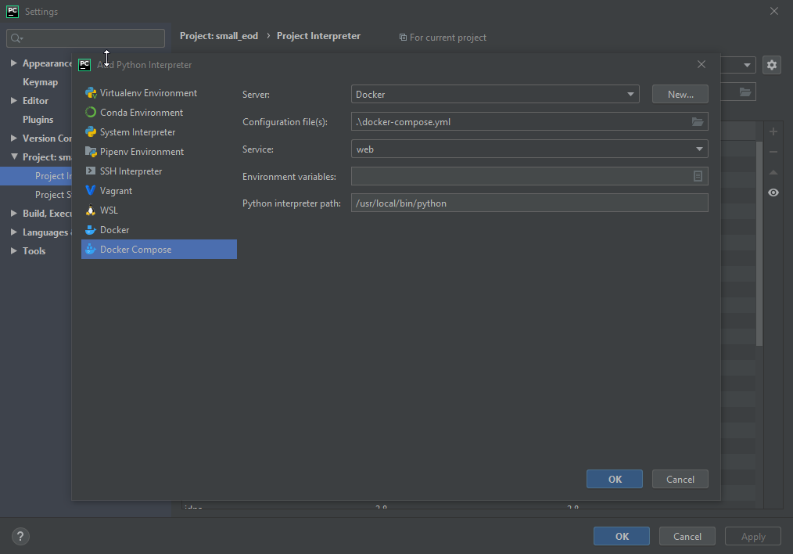
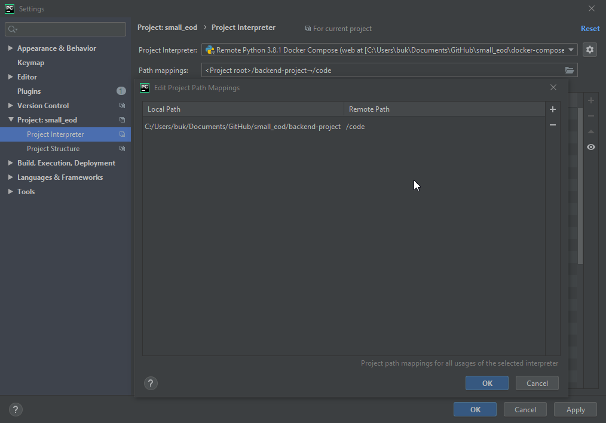
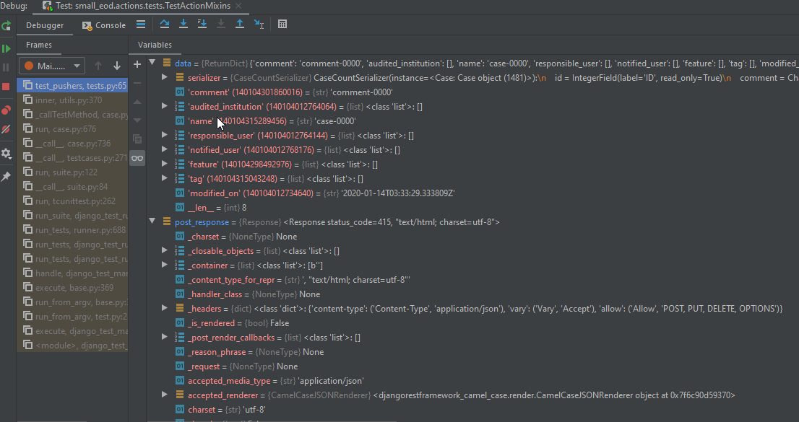

#### PyCharm
Niezależnie od platformy z uwagi na świętną integrację z [`Dockerem`](https://docs.docker.com/install/) i `Gitem` możliwa jest praca w środowisku [Pycharm](https://www.jetbrains.com/help/pycharm/installation-guide.html#). Automatycznie skonfiguruje on dla Ciebie repozytorium `git` i przełączy pliki na których aktualnie pracujesz (`git checkout`) jednocześnie nie tracąc poprzednich zmian.
 
 Aby skonfigurować Pycharm z naszym środowiskiem, wykonaj poniższe kroki
* Skonfiguruj `remote interpreter` 

W przypadku błędów połączenia z serwerem Dockera upewnij się że konfiguracja TLS dla Dockera jest prawidłowa - jeśli wiesz co robisz, możesz ją po prostu wyłączyć.

* Ustaw `path mappings`

* Zaczekaj aż Pycharm wykona index plików i już za chwilę możesz cieszyć się interaktywnym debuggerem i miłym środowiskiem pracy.

* Możesz również [skonfigurować `default template` dla testów django i zobaczyć jak można pracować z PyCharm](./images/workflow.gif)
